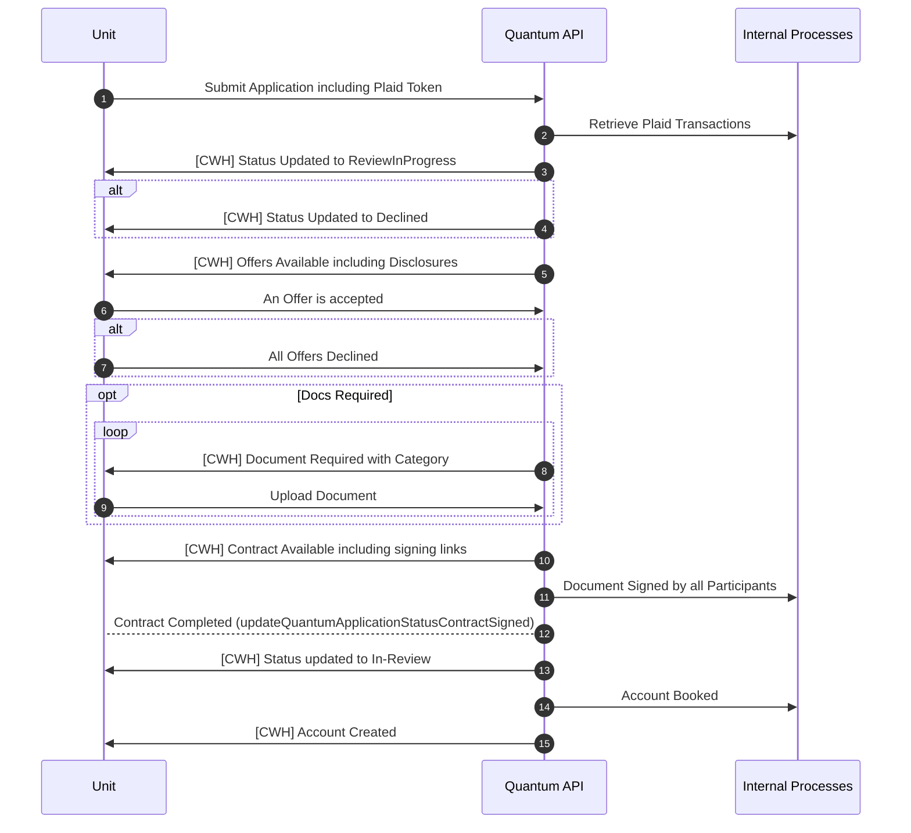

```mermaid
sequenceDiagram
    participant Unit
    participant Quantum API
    participant Internal Processes
    
    autonumber

    Unit ->> Quantum API: Submit Application including Plaid Token
    Quantum API ->> Internal Processes: Retrieve Plaid Transactions
    Quantum API ->> Unit: [CWH] Status Updated to ReviewInProgress
    alt 
        Quantum API ->> Unit: [CWH] Status Updated to Declined
    end 
    Quantum API ->> Unit: [CWH] Offers Available including Disclosures
    Unit ->> Quantum API: An Offer is accepted
    alt
        Unit ->> Quantum API: All Offers Declined
    end
    opt Docs Required
        loop
            Quantum API ->> Unit: [CWH] Document Required with Category
            Unit ->> Quantum API: Upload Document
        end
    end
    Quantum API ->> Unit: [CWH] Contract Available including signing links
    Quantum API ->> Internal Processes: Document Signed by all Participants
    Quantum API --> Unit: Contract Completed (updateQuantumApplicationStatusContractSigned)
    Quantum API ->> Unit: [CWH] Status updated to In-Review
    Quantum API ->> Internal Processes: Account Booked
    Quantum API ->> Unit: [CWH] Account Created
    
```
